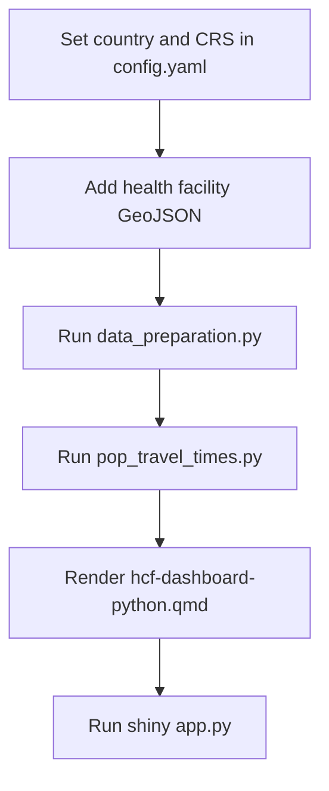

# Geospatial analysis of access to healthcare facilities

## About

Effective delivery of healthcare services requires populations to have sufficient access to healthcare facilities. Accurate mapping of a country’s national health system infrastructure can improve planning and management for healthcare provision and ensure equitable resource distribution, particularly in response to epidemics and outbreaks. Unfortunately, many low and middle income countries (LMICs) lack such resources. This work is aimed at addressing this gap by providing a generalised tool for mapping healthcare facilities and their accessibility to populations in LMICs. The tool is designed to be flexible, allowing users to configure the analysis for different countries.

This tool generates a map of healthcare facilities with metrics of accessibility for local populations in LMICs. It combines:

- Georeferenced healthcare facilities
- Small area population estimates ([WorldPop](https://www.worldpop.org/))
- Road network data ([OpenStreetMap](https://www.openstreetmap.org/) via [Geofabrik](https://www.geofabrik.de/))

Using road network routing software, the tool generates travel-time matrices between populated grid cells and healthcare facilities, then derives network distances from the travel times and presents them in an interactive dashboard.

> **Note:**
> This tool is intended for exploratory analysis. Outputs should be treated as indicative estimates, not definitive measures for operational or policy decisions without further validation. It is the user's responsibility to ensure the tool, input data, assumptions, and outputs are appropriate for their local context and use case. The workflow is designed to be adapted to support context-specific requirements.

### Project aims

**Phase 1:** Determine the feasibility of developing a product which maps healthcare facilities relative to the travel time (distance) to populations in Malawi. Build a prototype focussed on a specific context.

**Phase 2:** Develop a general usage product enabling creation of an output with user-defined datasets and context, supporting multiple countries.

## Getting started

Clone the repository and move into the project folder:

```bash
git clone https://github.com/datasciencecampus/geospatial-healthcare-facilities.git
cd geospatial-healthcare-facilities
```

Then follow the [Installation](#installation) steps for your chosen workflow.

## Repository structure

```
.
├── configs/                          # Shared configuration files
│   ├── config.yaml                   # Python workflow settings (CRS, data paths)
│   └── datasets.yaml                 # Input dataset path mappings
├── data/
│   ├── boundaries/                   # Admin boundary GeoJSONs
│   ├── network/                      # Downloaded OSM PBF files (per country)
│   ├── poi/                          # Healthcare facility CSVs (per country)
│   ├── population/                   # Processed WorldPop rasters (per country)
│   └── raw/                          # Raw data downloads (per country)
├── docs/
│   ├── python/                       # Python workflow documentation
│   └── r/                            # R workflow documentation
├── outputs/                          # Dashboard and analysis outputs (per country)
├── src/
│   ├── healthcare_accessibility/     # Python pipeline scripts
│   │   ├── data_preparation.py
│   │   ├── pop_travel_times.py
│   │   ├── accessibility_metrics.py
│   │   ├── hcf-dashboard-python.qmd
│   │   └── ...
│   └── r/
│       └── dashboard/                # R pipeline package
│           ├── config/config.yaml    # R workflow settings
│           ├── _run_all.R            # Script to run the full R workflow
│           ├── run/
│           │   ├── 01_preprocess.R
│           │   └── 02_ttm.R
│           ├── R/                    # R helper functions
│           ├── hcf-dashboard.qmd     # Interactive dashboard
│           └── tests/
├── requirements.txt
└── pyproject.toml
```

## Installation

### Python

Conda is recommended due to the number of geospatial packages that require compiled system libraries.

Within a Terminal navigate to the repository root and run:

```bash
conda env create -f environment.yml
conda activate hc-mapping
```

Then whilst still in the root folder, and in your chosen python environment, run the following in a terminal:

```bash
pip install -e .
```

The final `pip install -e .` installs the local `healthcare_accessibility` package in editable mode so that all scripts can import from it directly.

[Quarto](https://quarto.org/docs/get-started/) is also required for the dashboard.

> For full Python installation details see [docs/python/01-installation.md](docs/python/01-installation.md).

### R

**Prerequisites:** R 4.3 or later, Java 21 (for r5r), and [Quarto](https://quarto.org/docs/get-started/).

Install R package dependencies from the `DESCRIPTION` file:

```r
install.packages("devtools")
devtools::install_deps("src/r/dashboard", dependencies = TRUE)
```

If this fails on R 4.5 with version resolution errors, use `pak` instead:

```r
install.packages("pak")
pak::pak("osmdata@0.3.0")
pak::pak("r5r@2.3.0")
```

**Java setup:** the travel-time stage requires Java 21. Install and verify it from R:

```r
rJavaEnv::java_quick_install(version = 21)
rJavaEnv::java_check_version_rjava()
```

> For full R installation details see [docs/R/01-installation.md](docs/R/01-installation.md).

## Configuration

### Python

Edit `configs/config.yaml` before running any scripts. Key settings:

- `data_dir` / `outputs_dir`: input and output directories
- `analysis_crs`: projected CRS used for routing (e.g. `EPSG:20936`)
- `visualisation_crs`: CRS for outputs and dashboard (default `EPSG:4326`)

> For full configuration details see [docs/python/02-configuration.md](docs/python/02-configuration.md).

### R

Edit `src/r/dashboard/config/config.yaml`. Key settings:

- `country`: full English country name, used to name output files and drive WorldPop/Geofabrik downloads
- `crs`: output CRS (default `4326`)
- `districts_filepath` / `district_name_column`: provide a local boundary file, or leave blank to download from OpenStreetMap using `admin_level`
- `facility_list_filepath` or `facility_list_url`: local file path or downloadable URL for healthcare facility data
- `population_filepath`: local WorldPop zip file, or leave blank to download automatically
- `r5r.max_lts`: maximum level of traffic stress for cycling routes (default `4`)
- `r5r.bike_speed_kmh`: cycling speed used for travel time estimates

> For full configuration details see [docs/R/02-configuration.md](docs/R/02-configuration.md).

## Usage
This codebase has been developed in both python and R. They broadly achieve the same result, with some subtle differences.

### Python workflow

1. Configure `configs/config.yaml` with your country and CRS settings — see [docs/python/02-configuration.md](docs/python/02-configuration.md).
2. Prepare input data (OSM network, WorldPop, boundaries, facility GeoJSON) — see [docs/python/03-data-preparation.md](docs/python/03-data-preparation.md).
3. Run data preparation:
   ```bash
   python src/healthcare_accessibility/data_preparation.py
   ```
4. Run travel time analysis — see [docs/python/04-travel-time-analysis.md](docs/python/04-travel-time-analysis.md):
   ```bash
   python src/healthcare_accessibility/pop_travel_times.py
   ```
5. Optionally generate accessibility charts:
   ```bash
   python src/healthcare_accessibility/accessability_metrics.py
   ```
6. Render and launch the dashboard — see [docs/python/05-dashboard.md](docs/python/05-dashboard.md):
   ```bash
   quarto render src/healthcare_accessibility/hcf-dashboard-python.qmd
   shiny run src/healthcare_accessibility/app.py
   ```



See the 00-overview.md files in [`docs/python`](docs/python/00-overview.md) for more details.

### R workflow

1. Configure `src/r/dashboard/config/config.yaml` — see [docs/R/02-configuration.md](docs/R/02-configuration.md).
2. Prepare input data (boundaries, facilities, population) — see [docs/R/03-data-preparation.md](docs/R/03-data-preparation.md).
3. Run preprocessing:
   ```r
   source("src/r/dashboard/run/01_preprocess.R")
   ```
4. Run travel time analysis — see [docs/R/04-travel-time-analysis.md](docs/R/04-travel-time-analysis.md):
   ```r
   source("src/r/dashboard/run/02_ttm.R")
   ```
5. Render the dashboard in RStudio by opening `src/r/dashboard/hcf-dashboard.qmd` and clicking **Render**, or from a terminal — see [docs/R/05-dashboard.md](docs/R/05-dashboard.md):
   ```bash
   quarto preview src/r/dashboard/hcf-dashboard.qmd
   ```

Alternatively, run the full R workflow with a single script:

```r
source("src/r/dashboard/_run_all.R")
```

See the 00-overview.md files in [`docs/R`](docs/R/00-overview.md) for more details.

## Documentation

Full documentation for both workflows is in the [`docs/`](docs/) folder:

| | Python | R |
|---|---|---|
| Overview | [docs/python/00-overview.md](docs/python/00-overview.md) | [docs/R/00-overview.md](docs/R/00-overview.md) |
| Installation | [docs/python/01-installation.md](docs/python/01-installation.md) | [docs/R/01-installation.md](docs/R/01-installation.md) |
| Configuration | [docs/python/02-configuration.md](docs/python/02-configuration.md) | [docs/R/02-configuration.md](docs/R/02-configuration.md) |
| Data preparation | [docs/python/03-data-preparation.md](docs/python/03-data-preparation.md) | [docs/R/03-data-preparation.md](docs/R/03-data-preparation.md) |
| Travel time analysis | [docs/python/04-travel-time-analysis.md](docs/python/04-travel-time-analysis.md) | [docs/R/04-travel-time-analysis.md](docs/R/04-travel-time-analysis.md) |
| Dashboard | [docs/python/05-dashboard.md](docs/python/05-dashboard.md) | [docs/R/05-dashboard.md](docs/R/05-dashboard.md) |
| Troubleshooting | [docs/python/06-troubleshooting.md](docs/python/06-troubleshooting.md) | [docs/R/06-troubleshooting.md](docs/R/06-troubleshooting.md) |

# License

<!-- Unless stated otherwise, the codebase is released under [the MIT Licence][mit]. -->

The code, unless otherwise stated, is released under [the MIT Licence][mit].

The documentation for this work is subject to [© Crown copyright][copyright] and is available under the terms of the [Open Government 3.0][ogl] licence.

[mit]: LICENCE
[copyright]: http://www.nationalarchives.gov.uk/information-management/re-using-public-sector-information/uk-government-licensing-framework/crown-copyright/
[ogl]: http://www.nationalarchives.gov.uk/doc/open-government-licence/version/3/
