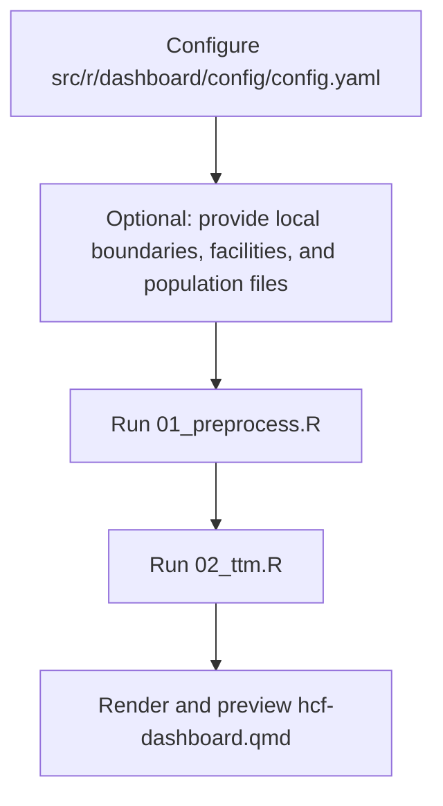

# R Workflow Overview

## What this workflow does

The R pipeline estimates travel times from populated grid cells to healthcare facilities across a road network, and presents the results in an interactive dashboard.

It combines:

- Road network data from [OpenStreetMap](https://www.openstreetmap.org/) (via [Geofabrik](https://www.geofabrik.de/))
- Gridded population estimates and demographic breakdowns from [WorldPop](https://www.worldpop.org/)
- Administrative boundaries from OpenStreetMap or a user-provided boundary file
- Health facility point data from a user-provided file or URL

## Where users provide data

Users can provide input data directly through the configuration file at `src/r/dashboard/config/config.yaml`.

- Boundaries: set `districts_filepath` to a local boundary file (instead of downloading from OpenStreetMap).
- Healthcare facilities: set `facility_list_filepath` to a local file, or `facility_list_url` to a downloadable source.
- Population: optionally set `population_filepath` to a local WorldPop zip file (otherwise the pipeline downloads from WorldPop using configured year and release values).

These user-provided inputs are then processed by `src/r/dashboard/run/01_preprocess.R` before travel-time analysis.

## Pipeline stages

| Stage | Script / file | Output |
| --- | --- | --- |
| Data preparation | `src/r/dashboard/run/01_preprocess.R` | Country boundaries GeoJSON, healthcare facilities CSV, and WorldPop geodemographics raster |
| Travel time analysis | `src/r/dashboard/run/02_ttm.R` | Closest travel-time results in CSV and Parquet |
| Dashboard render and launch | `src/r/dashboard/hcf-dashboard.qmd` | Local interactive Quarto + Shiny dashboard |

## Technology stack

| Component | Technology |
| --- | --- |
| Routing engine | [r5r](https://ipeagit.github.io/r5r/) |
| Geospatial processing | [sf](https://r-spatial.github.io/sf/), [terra](https://rspatial.github.io/terra/), [osmdata](https://docs.ropensci.org/osmdata/) |
| Population and data processing | [dplyr](https://dplyr.tidyverse.org/), [purrr](https://purrr.tidyverse.org/), [arrow](https://arrow.apache.org/docs/r/) |
| Dashboard framework | [Quarto](https://quarto.org/) + [Shiny for R](https://shiny.posit.co/r/) |
| Mapping | [Leaflet for R](https://rstudio.github.io/leaflet/) |

## Documentation pages

1. [01 — Installation](01-installation.md)
2. [02 — Configuration](02-configuration.md)
3. [03 — Data preparation](03-data-preparation.md)
4. [04 — Travel time analysis](04-travel-time-analysis.md)
5. [05 — Dashboard](05-dashboard.md)
6. [06 — Troubleshooting](06-troubleshooting.md)
