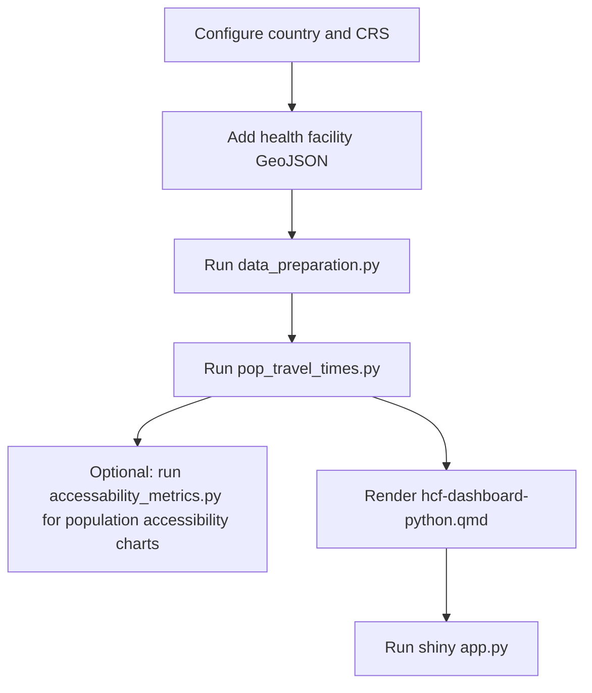

# Python Workflow Overview

## What this workflow does

The Python pipeline estimates travel times from populated grid cells to healthcare facilities across a road network, and presents the results in an interactive dashboard.

It combines:

- Road network data from [OpenStreetMap](https://www.openstreetmap.org/) (via [Geofabrik](https://www.geofabrik.de/))
- Gridded population estimates and demographic breakdowns from [WorldPop](https://www.worldpop.org/)
- Administrative boundaries from [geoBoundaries](https://www.geoboundaries.org/)
- Health facility point data (manually provided by the user)

## Pipeline stages

| Stage | Script / file | Output |
| --- | --- | --- |
| Data preparation | `src/healthcare_accessibility/data_preparation.py` | Processed GeoPackages |
| Travel time analysis | `src/healthcare_accessibility/pop_travel_times.py` | Parquet travel-time matrices + HTML maps |
| Optional post-processing | `src/healthcare_accessibility/accessability_metrics.py` | Population accessibility charts and summary views |
| Dashboard render | `src/healthcare_accessibility/hcf-dashboard-python.qmd` | `app.py` + static assets |
| Dashboard launch | `src/healthcare_accessibility/app.py` | Local Shiny web server |

## Technology stack

| Component | Technology |
| --- | --- |
| Routing engine | [r5py](https://r5py.readthedocs.io/) |
| Geospatial processing | [geopandas](https://geopandas.org/), [osmnx](https://osmnx.readthedocs.io/) |
| Population rasters | [rioxarray](https://corteva.github.io/rioxarray/), [geocube](https://corteva.github.io/geocube/) |
| Dashboard framework | [Quarto](https://quarto.org/) + [Shiny for Python](https://shiny.posit.co/py/) |
| Mapping | [Folium](https://python-visualization.github.io/folium/) |

## Documentation pages

1. [01 — Installation](01-installation.md)
2. [02 — Configuration](02-configuration.md)
3. [03 — Data preparation](03-data-preparation.md)
4. [04 — Travel time analysis](04-travel-time-analysis.md)
5. [05 — Dashboard](05-dashboard.md)
6. [06 — Troubleshooting](06-troubleshooting.md)
