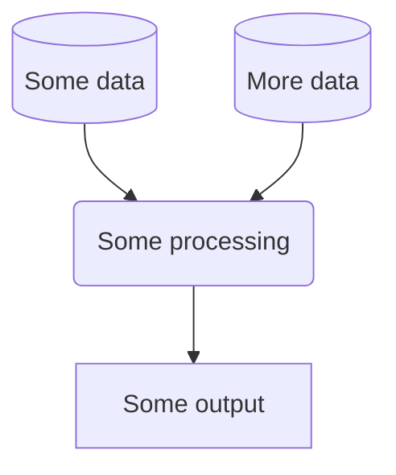

# Geospatial analysis of access to healthcare facilities

# Introduction
## About

The aim is to develop a tool that would enable generation of a map of healthcare facilities with metrics of accessibility for local populations for low and middle income countries.

Effective delivery of healthcare services requires populations to have sufficient access to healthcare facilities. Accurate mapping of a country’s national health system infrastructure can improve planning and management for healthcare provision and ensure equitable resource distribution, particularly in response to epidemics and outbreaks. Unfortunately, many sub-Saharan Africa (SSA) countries lack such resources. This work is aimed at attempting to address this.

The aim is to develop a tool that would enable generation of a map of healthcare facilities with metrics of accessibility for local populations for low and middle income countries. The broad approach will be to combine datasets of:

- georeferenced healthcare facilities
- small area population estimates, and
- maps of road networks.

Using road network maps and routing software packages, we will attempt to generate travel-time matrices between various locations. Combining these with the spatially resolved population datasets and healthcare facility positions we will generate population orientated travel times to healthcare facilities and derive metrics of accessibility to these facilities.

**Project aims**

**Phase 1:** Determine the feasibility of developing a product which maps healthcare facilities relative to the travel time (distance) to populations in Malawi. Build a prototype focussed on a specific context. 

**Phase 2:** If Phase 1 is a success, develop a general usage product enabling creation of an output with user defined datasets and context.  

## Installation

Recommend use of conda due to numerous geospatial packages being required. 

```
conda create -n myenv python=3.11
```

```
conda activate myenv
```

```
conda install -c conda-forge r5py osmnx
```

The project uses a local python package. This needs to be installed by doing the following:

Whilst in the root folder, and in your chosen python environment, run the following in a terminal:

`pip install -e .`


### Pre-commit actions
This repository contains a configuration of pre-commit hooks. These are language agnostic and focussed on repository security (such as detection of passwords and API keys). If approaching this project as a developer, you are encouraged to install and enable `pre-commits` by running the following in your shell:
   1. Install `pre-commit`:

      ```
      pip install pre-commit
      ```
   2. Enable `pre-commit`:

      ```
      pre-commit install
      ```
Once pre-commits are activated, whenever you commit to this repository a series of checks will be executed. The pre-commits include checking for security keys, large files and unresolved merge conflict headers. The use of active pre-commits are highly encouraged and the given hooks can be expanded with Python or R specific hooks that can automate the code style and linting. For example, the `flake8` and `black` hooks are useful for maintaining consistent Python code formatting.

**NOTE:** Pre-commit hooks execute Python, so it expects a working Python build.

## Usage
*Explain how to use the things in the repo.*

### Workflow
*You may wish to consider generating a graph to show your project workflow. GitHub markdown provides native support for [mermaid](https://mermaid.js.org/syntax/flowchart.html), an example of which is provided below:*




# Data Science Campus
At the [Data Science Campus](https://datasciencecampus.ons.gov.uk/about-us/) we apply data science, and build skills, for public good across the UK and internationally. Get in touch with the Campus at [datasciencecampus@ons.gov.uk](datasciencecampus@ons.gov.uk).

# License

<!-- Unless stated otherwise, the codebase is released under [the MIT Licence][mit]. -->

The code, unless otherwise stated, is released under [the MIT Licence][mit].

The documentation for this work is subject to [© Crown copyright][copyright] and is available under the terms of the [Open Government 3.0][ogl] licence.

[mit]: LICENCE
[copyright]: http://www.nationalarchives.gov.uk/information-management/re-using-public-sector-information/uk-government-licensing-framework/crown-copyright/
[ogl]: http://www.nationalarchives.gov.uk/doc/open-government-licence/version/3/
